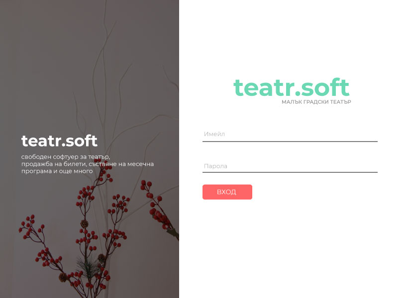

# TeatrSoft - Theater Management Desktop App

## Overview

TeatrSoft is a desktop application designed for comprehensive theater management. Originally inspired by a [tutorial on YouTube](https://www.youtube.com/watch?v=wfWxdh-_k_4&t=27s), the project has evolved into a feature-rich tool for handling various aspects of theater management, including but not limited to adding actors, creating programs, selling tickets, managing users, customizing scene schema, defining price levels for seats, generating, and printing tickets, and much more.

## Features

- **Theater Management:** Add, edit, and manage details about theaters, including their name, location, and contact information.

- **Actor Management:** Keep track of actors associated with the theater, including their personal information, roles, and availability.

- **Program Creation:** Easily create and manage theater programs, including details about the plays, schedules, and involved actors.

- **Ticket Sales:** Sell tickets for theater programs, manage seating arrangements, and keep track of attendance.

- **User Management:** Efficiently manage user accounts.

- **Customized Scene Schema:** Define and customize the seating arrangement of the theater's scene for each program.

- **Price Levels for Seats:** Set different price levels for seats based on location, category, or other criteria.

- **Ticket Generation and Printing:** Automatically generate and print tickets for purchased seats.

- **User-Friendly Interface:** Intuitive and easy-to-use interface for efficient theater management.

## Prerequisites

Before running TeatrSoft, ensure you have the following prerequisites installed:

- **Visual Studio:** TeatrSoft is developed using Visual Studio, and it is recommended to use this IDE for building and running the application.

- **MySQL Client:** TeatrSoft relies on MySQL for data storage. Make sure you have a MySQL client installed and configured.

## Getting Started

1. Clone the TeatrSoft repository to your local machine.

   ```bash
   git clone https://github.com/your-username/teatrsoft.git
   ```

2. Open the project in Visual Studio.

3. Set up the database:

   - Create a new MySQL database for TeatrSoft.
   - Execute the provided database script (not included in the repository). If you need the script, please contact me.

   **Note: The SQL script for the database is not included in the repository. If needed, please contact me.**

4. Configure the database connection:

   - Update the database connection settings in the application to match your MySQL database.

5. Build and run the TeatrSoft application.

## Screenshots

\
\


